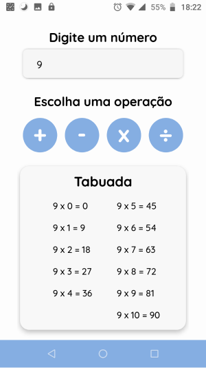

<h1 align="center">
    
</h1>

<p align="center">
    <a href="https://github.com/JonataRamalho">
        
    </a>
    
    
</p>

<br/>

> Tabuada para praticar as operações de adição, subtração, multiplicação e divisão no smartphone.

---

# :pushpin:  Índice

<p align="left">
    <ul>
        <li><a href="#rocket-tecnologias">Tecnologia</a></li>
        <li><a href="#information_source-como-usar">Como usar</a></li>
        <li><a href="#iphone-layout">Layout</a></li>
        <li><a href="#thinking-como-contribuir">Como contribuir</a></li>
    </ul>
    
</p>

<br/>
<br/>

# :rocket: Tecnologia

Esse projeto foi desenvolvido com a seguinte tecnologia:
- [Expo](https://expo.io/)

<br/>

# :information_source: Como usar

Para o projeto funcionar no seu computador instale o [Node.js](https://nodejs.org/en/) e o [Expo](https://docs.expo.io/get-started/installation/). Na sua linha de comando:

```bash
# Clone este repositório:
$ git clone https://github.com/JonataRamalho/table-math.git

# Vá para o repositório:
$ cd table-math
		
# Instale as dependências:
$ npm install ou yarn install

# Inicie o Expo:
$ expo start
```

<br/>

# :iphone: Layout

<h1 align="center">
    &nbsp;&nbsp;&nbsp;
    
</h1>

# :thinking: Como contribuir

- Faça um fork desse repositório (https://github.com/JonataRamalho/table-math.git);

- Cria uma branch com a sua feature: ```git checkout -b new-feature```;

- Faça o commit das suas alterações: ```git commit -m 'Novo recurso'```;

- Faça o push para a sua branch: ```git push origin new-feature```;

- Depois que o merge da sua pull request for feito, você pode deletar a sua branch.

Feito por [Jonata Ramalho](https://github.com/JonataRamalho) :wink: